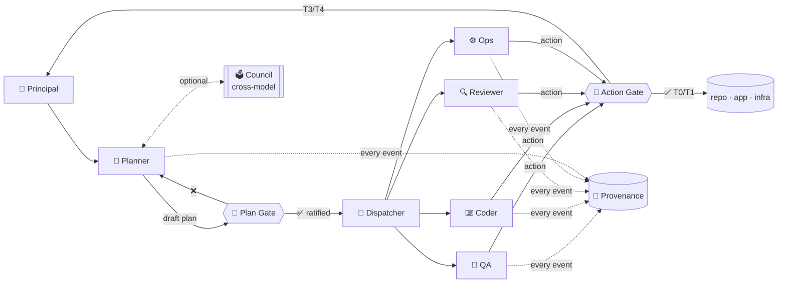

# Conclave

> A **human-in-the-loop, hierarchical multi-agent framework** for software-engineering and
> workflow-automation tasks — organized like a small company, with mandatory human ratification
> on irreversible actions.

[](./LICENSE)
&nbsp;Status: **early R&D / open prototype** &nbsp;·&nbsp;
Specification: [`conclave-spec.md`](./conclave-spec.md)

---

## Why

Fully autonomous LLM agents couple **decision** and **enactment** with no ratification step.
The canonical failure mode is the agent that, after one misread prompt, drops a production database
in nine seconds. Conclave addresses this with two structural commitments:

1. **Decouple decision from enactment.** Irreversible actions are *proposed*, not *performed*, until
   a human ratifies them. Low-risk / reversible actions still flow autonomously so the human is not
   drowned in trivial approvals.
2. **Decompose-and-specialize.** A **Planner** decomposes the goal; scoped **expert sub-agents**
   execute narrow sub-tasks with least-privilege capabilities. A QA agent that can *read* the app
   has no permission to *delete* anything.

A complementary, optional **Council** layer formalizes the multi-model intuition — asking Claude,
GPT, and Gemini the same hard question, having them critique each other, and synthesizing a
stronger answer than any one alone — with explicit anti-conformity safeguards
(see [`conclave-spec.md` §8.3](./conclave-spec.md)).

## The architecture in one diagram



## Repository layout

```
Agency/                              ← repo root (project name TBD, see spec §16)
├── README.md                        ← you are here
├── AGENTS.md                        ← entry point for any LLM coding agent reading the repo
├── conclave-spec.md                 ← full engineering + research specification
├── LICENSE                          ← MIT
│
├── shared/                          ← cross-cutting contracts every agent depends on
│   ├── schemas/                     ← JSON Schemas: plan, task, action-proposal, message, event
│   ├── approval-gate/               ← risk-tier classifier + approval UX skill
│   ├── provenance/                  ← append-only event log skill
│   ├── council/                     ← cross-model deliberation skill
│   └── skills.registry.yaml         ← discoverable skill registry
│
├── planner-agent/                   ← PM / Master — decomposes goals, drafts plans, dispatches
│   ├── planner.agent.md
│   └── planner-runner/SKILL.md
│
├── coder-agent/                     ← scaffold — implements changes per the plan
├── e2e-agent/                       ← ✅ Phase-0 built — Playwright E2E expert (runs after the coder)
│   ├── e2e.agent.md
│   ├── e2e-runner/SKILL.md
│   └── e2e-test/                    ← user-supplied test definitions
├── qa-agent/                        ← QA / Validation — fact-checks outputs against evidence
├── reviewer-agent/                  ← scaffold — reviews diffs, runs linters
├── researcher-agent/                ← 🌐 web search + source-cited synthesis (first real tool)
│
├── runtime/                         ← MVP Python execution layer (FastAPI + Ollama + dashboard)
│   ├── conclave/                    ← orchestrator, provider abstraction, event bus, provenance
│   ├── static/dashboard.html        ← live dashboard: agent cards, principal chat, event feed
│   └── agents.config.yaml           ← per-agent model/provider binding
│
├── examples/
│   └── forgot-password-flow/        ← worked end-to-end example (mirrors spec Appendix A)
│
└── research/                        ← the empirical study (RQ1–RQ5)
    ├── testbed/                     ← sandboxed env + tripwires
    ├── task-suite/                  ← tasks incl. trap tasks
    ├── harness/                     ← C1–C5 conditions, matched-compute accounting
    └── preregistration.template.md
```

## What's built vs. what's planned

| Phase | Milestone | Status |
|---|---|---|
| 0 | Playwright E2E agent (standalone) | ✅ in [`e2e-agent/`](./e2e-agent/) |
| 1 | Planner + plan artifact + approval gate + provenance + dispatcher | 🚧 scaffolded in this repo (`planner-agent/`, `shared/`) |
| 2 | Coder + Reviewer + sequential hand-off + capability/permission layer | 🚧 scaffolded (`coder-agent/`, `reviewer-agent/`) |
| 2.5 | **MVP runtime**: per-agent Ollama binding, planner-only chat, live dashboard | ✅ in [`runtime/`](./runtime/) |
| 3 | Council (cross-model) + recoverability subsystem | 📐 spec only |
| 4 | Research testbed + task suite + harness (C1–C5, matched compute) | 📐 spec + templates in [`research/`](./research/) |
| 5 | Run study, write paper, first OSS release | 📅 planned |

## How a run works (today, on top of a markdown-agent IDE)

Conclave is intentionally markdown-first: every agent is a `*.agent.md` file with a `SKILL.md`,
loadable by any agent IDE (VS Code Copilot, Claude Code, Cursor, etc.). A run lives entirely
on disk under `runs/<run-id>/` so it is grep-able, diffable, and replayable.

1. **Principal** writes a goal: `runs/<id>/goal.md`.
2. **Planner** reads the goal, drafts `runs/<id>/plan.draft.json` against
   [`shared/schemas/plan.schema.json`](./shared/schemas/plan.schema.json), emits
   `plan_drafted` + `approval_requested` events to `runs/<id>/provenance.jsonl`, and pauses.
3. **Principal** ratifies (or edits & ratifies) → `plan.ratified.json`.
4. **Dispatcher** invokes the named expert sub-agent for each task. Each sub-agent loads its
   `*.agent.md`, executes within its capability grant, and emits structured results.
5. For any action above the agent's risk ceiling (T3/T4 by default), the sub-agent emits an
   `ActionProposal` instead of acting; the **Approval Gate** halts execution until the principal
   ratifies. T4 additionally requires a verified snapshot/backup before approval can even be requested.
6. Every event lands in `provenance.jsonl`. The run is fully replayable.

See [`examples/forgot-password-flow/`](./examples/forgot-password-flow/) for a complete worked trace.

## Quickstart (for contributors)

```bash
git clone <this-repo> conclave && cd conclave

# Read the spec and the agent entry point
$EDITOR conclave-spec.md AGENTS.md
```

**Markdown-first usage** (any agent IDE — Copilot, Claude Code, Cursor, Aider):

```
# Point your IDE at:
#   qa-agent/qa.agent.md            — invoke as the QA / validation expert
#   planner-agent/planner.agent.md  — invoke as the planner
```

**Standalone runtime** (Python + local Ollama + live dashboard):

```powershell
cd runtime
python -m venv .venv ; .\.venv\Scripts\Activate.ps1
pip install -r requirements.txt
ollama pull llama3.1:8b
python -m conclave
# open http://localhost:8765/
```

In the runtime, you chat with the **Planner** in the dashboard's chat pane; sub-agents are
invoked automatically and their activity streams to the event feed in real time. See
[`runtime/README.md`](./runtime/README.md) for full setup and configuration.

The framework is **model-agnostic** — agents bind to a model *interface*, not a vendor. Swapping
Claude ↔ GPT ↔ Gemini ↔ a local model is a config change (and is the substrate the Council layer
uses for cross-model deliberation).

## Research

The companion empirical study compares a single-model **super-agent** (one model, all skills, no
decomposition) against the multi-agent + HITL architecture across **performance, safety, and
recoverability**, under a **matched thinking-token budget** (critical — most published comparisons
do not control for compute).

- Research questions, conditions (C1–C5), metrics, testbed: [`conclave-spec.md` §9](./conclave-spec.md)
- Pre-registration template & harness scaffolding: [`research/`](./research/)

## Trustworthy-AI framing

Conclave operationalizes the **safety and controllability** dimension of trustworthy AI for the
emerging class of autonomous LLM agents:

- Mandatory human approval gates on irreversible action.
- Decomposable skill modules + least-privilege capabilities → bounded blast radius per agent.
- Transparent task delegation + complete provenance → every action explainable and auditable.
- Recoverability preconditions on T4 → the most dangerous actions cannot even be *proposed*
  without a verified path back.

See [`conclave-spec.md` §11](./conclave-spec.md).

## Independence statement

This project originated from exploratory prototyping during a Microsoft internal hackathon and
continues as an **independent open-source R&D effort conducted outside the scope of the author's
employment responsibilities at Microsoft**. The goal is generalizable tooling and a peer-reviewed
empirical study with impact beyond any single employer. Findings and tooling are released publicly
through this repository and forthcoming peer-reviewed publication.

## License

MIT — see [`LICENSE`](./LICENSE). The intent is permissive use by US researchers, startups, and
small businesses.

## Contributing

Issues and PRs welcome. Read [`CONTRIBUTING.md`](./CONTRIBUTING.md) and the architecture sections
of [`conclave-spec.md`](./conclave-spec.md) before submitting.
