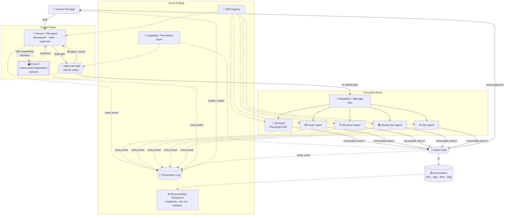
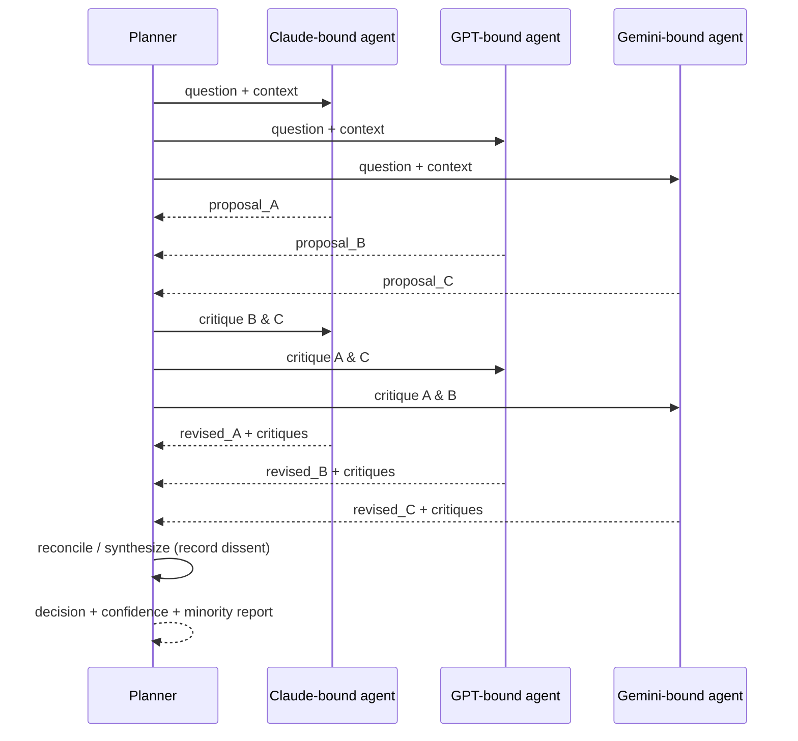

# Conclave — A Human-in-the-Loop Multi-Agent Framework for Software Engineering & Workflow Automation

> **Working name:** *Conclave* (placeholder — see [§16](#16-naming--branding)).
> A "conclave" is a deliberative body that meets under a presiding authority and whose
> decisions are ratified rather than self-enacting. That is exactly the relationship this
> system models: a council of specialized AI agents deliberates and proposes, a presiding
> planner organizes the work, and a **human principal ratifies** before anything irreversible happens.

| Field | Value |
|---|---|
| **Document type** | Engineering + research specification (design doc) |
| **Status** | Draft v0.1 — Phase 1 (QA sub-agent) implemented; Phase 2 (multi-agent) in design |
| **Owner** | *(you)* |
| **Audience** | Contributors, collaborators, reviewers, prospective open-source users |
| **License (intended)** | Apache-2.0 or MIT (permissive, US-researcher/startup/SMB friendly) |
| **Relationship to employment** | Independent open-source R&D conducted outside the scope of the author's employment responsibilities at Microsoft. Originated from exploratory prototyping during an internal hackathon; continues as an independent effort. Findings and tooling to be released publicly via GitHub and peer-reviewed publication. |

---

## Table of Contents

- [Conclave — A Human-in-the-Loop Multi-Agent Framework for Software Engineering \& Workflow Automation](#conclave--a-human-in-the-loop-multi-agent-framework-for-software-engineering--workflow-automation)
  - [Table of Contents](#table-of-contents)
  - [1. TL;DR / Abstract](#1-tldr--abstract)
  - [2. Motivation \& Problem Statement](#2-motivation--problem-statement)
    - [2.1 The autonomy spectrum and its failure mode](#21-the-autonomy-spectrum-and-its-failure-mode)
    - [2.2 Two structural ideas](#22-two-structural-ideas)
    - [2.3 The cross-model deliberation intuition](#23-the-cross-model-deliberation-intuition)
    - [2.4 Why this is worth publishing](#24-why-this-is-worth-publishing)
  - [3. Goals \& Non-Goals](#3-goals--non-goals)
    - [3.1 Goals](#31-goals)
    - [3.2 Non-Goals (v1)](#32-non-goals-v1)
  - [4. Core Concepts \& Terminology](#4-core-concepts--terminology)
  - [5. System Architecture](#5-system-architecture)
    - [5.1 High-level diagram](#51-high-level-diagram)
    - [5.2 Planes](#52-planes)
    - [5.3 Design principles](#53-design-principles)
  - [6. Component Specifications](#6-component-specifications)
    - [6.1 Planner / PM Agent](#61-planner--pm-agent)
    - [6.2 Expert Sub-Agent Runtime](#62-expert-sub-agent-runtime)
    - [6.3 Skill Specification](#63-skill-specification)
    - [6.4 Approval Gate \& Risk-Tier Spec](#64-approval-gate--risk-tier-spec)
    - [6.5 Inter-Agent Message Schema](#65-inter-agent-message-schema)
    - [6.6 Provenance Log](#66-provenance-log)
    - [6.7 Recoverability Subsystem](#67-recoverability-subsystem)
  - [7. Reference Sub-Agent: Playwright QA Agent (Phase 1, built)](#7-reference-sub-agent-playwright-qa-agent-phase-1-built)
  - [8. Multi-Agent Collaboration Design (Phase 2)](#8-multi-agent-collaboration-design-phase-2)
    - [8.1 Roles to add](#81-roles-to-add)
    - [8.2 Collaboration patterns](#82-collaboration-patterns)
    - [8.3 Council protocol](#83-council-protocol)
    - [8.4 When NOT to use multi-agent / Council](#84-when-not-to-use-multi-agent--council)
  - [9. Research \& Evaluation Plan](#9-research--evaluation-plan)
    - [9.1 Research questions](#91-research-questions)
    - [9.2 Experimental conditions](#92-experimental-conditions)
    - [9.3 Metrics](#93-metrics)
    - [9.4 Testbed \& task suite](#94-testbed--task-suite)
    - [9.5 Analysis plan](#95-analysis-plan)
  - [10. Related Work](#10-related-work)
  - [11. Safety \& Trustworthy-AI Framing](#11-safety--trustworthy-ai-framing)
  - [12. Technology Stack](#12-technology-stack)
  - [13. Repository Layout](#13-repository-layout)
  - [14. Roadmap \& Milestones](#14-roadmap--milestones)
  - [15. Open-Source \& Publication Plan](#15-open-source--publication-plan)
  - [16. Naming \& Branding](#16-naming--branding)
  - [17. Risks \& Open Questions](#17-risks--open-questions)
  - [Appendix A: End-to-End Trace](#appendix-a-end-to-end-trace)
  - [Appendix B: Glossary](#appendix-b-glossary)

---

## 1. TL;DR / Abstract

Conclave is a **hierarchical, human-in-the-loop (HITL) multi-agent framework** for autonomous
software-engineering and workflow-automation tasks. The system is organized like a small company:

- A **Planner (a.k.a. PM / "Master") agent** performs the highest level of design — it decomposes a
  goal into a plan and routes sub-tasks to specialists. **The plan is an artifact that the human
  principal must approve before any irreversible work is dispatched.**
- A set of **expert sub-agents** (QA, Coder, Reviewer, Researcher, Ops, etc.) execute the approved
  sub-tasks. Each agent is endowed with a scoped bundle of **skills** and only the **capabilities/permissions**
  it needs (principle of least privilege).
- An optional **Council (cross-model deliberation) layer** lets multiple models (e.g. Claude, GPT,
  Gemini) propose, critique, and reconcile answers on high-uncertainty decisions — operationalizing the
  intuition that asking several models and having them argue tends to yield a better answer than any one
  alone.
- **Approval gates** sit on the boundary of every irreversible action. Mandatory human ratification at
  these gates is the mechanism by which the framework aims to prevent the canonical failure mode of fully
  autonomous agents: *the agent that drops the production database in nine seconds.*

The project ships two deliverables: **(1)** an open-source reference implementation on GitHub, and
**(2)** a peer-reviewed empirical study comparing a single-model **"super-agent"** (one model holding all
skills, no decomposition) against the multi-agent + HITL architecture, measured across **performance,
safety, and recoverability**.

---

## 2. Motivation & Problem Statement

### 2.1 The autonomy spectrum and its failure mode

LLM agents increasingly take *actions*: they call APIs, edit infrastructure, modify databases, run shell
commands, and trigger downstream workflows. The more autonomy we grant, the larger the **blast radius** of
a single bad decision. A misread prompt, a hallucinated path, or a confidently-wrong plan can produce an
**irreversible, high-blast-radius action** — the prototypical example being a destructive command
(`DROP TABLE`, `rm -rf`, force-push, mass-delete) executed before any human can intervene.

The core problem: **fully autonomous agents couple *decision* and *enactment* with no ratification step.**
By the time a human notices, the action is done and may be unrecoverable.

### 2.2 Two structural ideas

Conclave addresses this with two structural commitments:

1. **Decouple decision from enactment via approval gates.** Irreversible actions are *proposed*, not
   *performed*, until a human ratifies them. Reversible / low-blast-radius actions can proceed
   autonomously, so the human is not drowned in trivial approvals.

2. **Decompose-and-specialize instead of one monolithic agent.** A planner decomposes the goal; scoped
   specialists execute narrow sub-tasks with least-privilege capabilities. A QA agent that can *read* the
   app and *run* tests has no permission to *delete* anything. This shrinks the blast radius per agent.

### 2.3 The cross-model deliberation intuition

A complementary observation motivates the **Council** layer. In practice, a skilled human working on a
hard problem will often pose it to several models (Claude, GPT, Gemini), notice where they agree, disagree,
or emphasize different things, and shuttle the answers back and forth until a stronger synthesis emerges.
Conclave formalizes this as an explicit, logged deliberation protocol available to the planner for
high-uncertainty or high-stakes decisions.

> **Important nuance (from the literature, see [§10](#10-related-work)):** multi-agent debate is *not*
> uniformly beneficial. It can collapse into mere ensembling, and majority pressure can suppress a correct
> minority. Conclave therefore treats the Council as an *opt-in tool for specific decision classes*, and the
> research plan is explicitly designed to measure when it helps versus when it hurts.

### 2.4 Why this is worth publishing

The recent literature suggests the multi-agent-vs-single-agent tradeoff is **subtle and capability-dependent**,
that multi-agent systems fail in **predictable, taxonomizable ways**, and that **compute is rarely held
constant** in published comparisons. A controlled study that (a) holds compute constant, (b) adds the HITL
and recoverability dimensions that prior work largely omits, and (c) ships a reusable open-source harness,
is a genuine contribution rather than a re-tread.

---

## 3. Goals & Non-Goals

### 3.1 Goals

- **G1 — Safety/controllability:** Reduce the rate and severity of unintended destructive actions through
  mandatory approval gates on irreversible operations.
- **G2 — Transparency/auditability:** Produce a complete, replayable provenance trail (plan → approval →
  delegation → action → result) for every run.
- **G3 — Modularity:** Skills and sub-agents are composable, declaratively specified, and reusable across
  projects.
- **G4 — Empirical rigor:** Provide a controlled harness to compare architectures on performance, safety,
  and recoverability under matched compute budgets.
- **G5 — Generalizable tooling:** Release an open-source framework usable by researchers, startups, and
  small businesses, not tied to a single vendor or employer.

### 3.2 Non-Goals (v1)

- **Not** a fully autonomous "fire-and-forget" agent. HITL is a feature, not a limitation to be removed.
- **Not** a model-training project. Conclave orchestrates existing frontier/open models; it does not train them.
- **Not** a general-purpose RPA/GUI-automation product (though the QA sub-agent uses browser automation).
- **Not** a benchmark of raw model quality. The study controls for the underlying model; the *unit of
  comparison is the architecture*.

---

## 4. Core Concepts & Terminology

| Term | Definition |
|---|---|
| **Principal** | The human user. Sets goals, approves plans, holds veto power, owns the risk budget. |
| **Planner (PM / Master)** | The top-level agent that decomposes goals into plans and routes sub-tasks. Cannot itself perform irreversible actions. |
| **Expert Sub-Agent** | A specialist agent (QA, Coder, Reviewer, Researcher, Ops, Data…) that executes a scoped sub-task using its skill bundle and capability set. |
| **Skill** | A declaratively-specified, reusable capability unit (instructions + tools + optional code) that can be attached to an agent. |
| **Capability / Permission** | A grant authorizing an agent to use a specific tool or perform a class of action (e.g. `read:repo`, `run:tests`, `write:filesystem:sandbox`). Default deny. |
| **Approval Gate** | A checkpoint where execution pauses pending human ratification. Triggered by the action's risk tier. |
| **Risk Tier** | Classification of an action by reversibility × blast radius (see [§6.4](#64-approval-gate--risk-tier-spec)). |
| **Council** | An optional cross-model deliberation protocol (propose → critique → reconcile → vote/synthesize). |
| **Plan** | A structured, versioned artifact: an ordered/DAG set of tasks with assignees, capabilities, risk tiers, and gates. |
| **Provenance Log** | The append-only, replayable record of everything the system did and why. |
| **Recoverability** | The system's ability to undo or restore after a bad action (snapshots, dry-runs, sandboxes). |
| **Super-Agent ("Superman")** | The baseline architecture: a single model holding *all* skills, no decomposition. The control condition in the study. |

---

## 5. System Architecture

### 5.1 High-level diagram



### 5.2 Planes

- **Control plane:** the Planner, the approval gates, and the optional Council. This is where *decisions*
  are made and ratified. Nothing here touches the environment directly.
- **Execution plane:** the expert sub-agents and the dispatcher/message bus. This is where *enactment*
  happens — but only through capability-scoped tools and only after gates clear.
- **Cross-cutting concerns:** the skill registry, the capability/permission layer, the provenance log, and
  the recoverability subsystem. Every other component depends on these.

### 5.3 Design principles

1. **Decision/enactment separation.** Planning and approval are structurally distinct from action.
2. **Least privilege.** Agents are denied all capabilities by default; the plan grants only what each
   sub-task needs.
3. **Reversibility-aware gating.** Gate friction is proportional to risk. Reversible actions flow freely;
   irreversible ones stop for a human.
4. **Everything is logged and replayable.** The provenance log is the source of truth for auditability and
   for the research harness.
5. **Model-agnostic.** Agents bind to a model *interface*, not a vendor. Swapping Claude ↔ GPT ↔ Gemini ↔
   a local model is a config change.
6. **Skills over hard-coding.** New capabilities are added by authoring skills, not by forking the core.

---

## 6. Component Specifications

> The interfaces below are illustrative (TypeScript-flavored / YAML). Treat them as the contract surface,
> not a final API.

### 6.1 Planner / PM Agent

**Responsibilities**

- Ingest the principal's goal + context.
- Produce a **Plan** (task DAG) with, per task: a description, an assignee role, the minimal capability set,
  a risk tier, success criteria, and dependencies.
- Submit the plan to the approval gate; revise on rejection.
- Supervise execution: monitor sub-agent results, re-plan on failure, escalate to the Council or the
  principal when uncertain.
- **Never** holds destructive capabilities itself.

**Interface (sketch)**

```typescript
interface Planner {
  decompose(goal: Goal, context: Context): Plan;          // → DAG of Tasks
  revisePlan(plan: Plan, feedback: HumanFeedback): Plan;
  superviseExecution(plan: Plan): RunReport;
  shouldConvene(decision: Decision): boolean;             // → invoke Council?
}

interface Plan {
  id: string;
  version: number;
  goal: Goal;
  tasks: Task[];                  // nodes
  edges: Dependency[];            // DAG edges
  approvalState: "draft" | "pending" | "ratified" | "rejected";
}

interface Task {
  id: string;
  description: string;
  assigneeRole: AgentRole;        // "qa" | "coder" | "reviewer" | ...
  requiredCapabilities: Capability[];
  riskTier: RiskTier;             // see §6.4
  successCriteria: string;
  dependsOn: string[];            // task ids
}
```

### 6.2 Expert Sub-Agent Runtime

**Responsibilities**

- Accept a ratified task scoped to its role.
- Load its skill bundle and bind to its model + tool set.
- Execute the task within its granted capabilities.
- Emit structured results, intermediate reasoning summaries, and provenance events.
- For any action above its autonomous risk ceiling, *propose* the action and pause at an Action Gate.

**Interface (sketch)**

```typescript
interface SubAgent {
  role: AgentRole;
  model: ModelBinding;             // vendor-agnostic
  skills: Skill[];
  capabilities: Capability[];      // least-privilege grant for this task
  riskCeiling: RiskTier;           // max tier it may enact without a gate

  execute(task: Task): Promise<TaskResult>;
  proposeAction(a: Action): ActionProposal;   // for above-ceiling actions
}
```

### 6.3 Skill Specification

A **skill** is a self-contained, declaratively-described capability bundle. Skills are discoverable in a
registry and attachable to any agent whose role and capabilities permit them.

```yaml
# skills/playwright-e2e/skill.yaml
name: playwright-e2e
version: 0.3.0
summary: Run user-defined end-to-end browser tests and report results.
applies_to_roles: [qa]
instructions: ./SKILL.md          # natural-language usage guide for the agent
tools:
  - id: pw.run_test
    description: Execute a Playwright test file against a target URL.
    requires_capability: run:tests
  - id: pw.list_tests
    requires_capability: read:repo
inputs_schema: ./inputs.schema.json
outputs_schema: ./outputs.schema.json
default_risk_tier: T1               # tests are read-only / reversible
```

**Skill design rules**

- A skill declares the **capabilities** its tools require; the runtime refuses to load a skill whose
  capabilities exceed the agent's grant.
- A skill declares a **default risk tier** per tool, which the gate policy can override.
- Skills are versioned and independently testable.

### 6.4 Approval Gate & Risk-Tier Spec

Risk is classified along two axes — **reversibility** and **blast radius** — collapsed into ordered tiers.

| Tier | Reversibility | Blast radius | Examples | Default policy |
|---|---|---|---|---|
| **T0** | n/a (read-only) | none | read files, query (SELECT), run tests, search web | Auto-allow |
| **T1** | Trivially reversible | local/sandbox | write to sandbox FS, create branch, draft PR | Auto-allow (logged) |
| **T2** | Reversible w/ effort | bounded | commit, push to feature branch, modify config in staging | Notify + auto-allow OR soft gate (policy-configurable) |
| **T3** | Hard to reverse | wide | merge to main, deploy to staging, schema migration (with backup) | **Mandatory human approval** |
| **T4** | Irreversible | critical | drop/delete data, force-push main, deploy to prod, mass-email, spend money | **Mandatory human approval + recoverability precondition (snapshot/backup must exist)** |

```typescript
interface ApprovalGate {
  classify(action: Action): RiskTier;
  policyFor(tier: RiskTier, ctx: Context): GatePolicy;     // allow | notify | require_approval | block
  requestApproval(proposal: ActionProposal): Promise<ApprovalDecision>;
}

interface ActionProposal {
  action: Action;
  proposedBy: AgentRole;
  riskTier: RiskTier;
  rationale: string;               // why the agent wants to do this
  reversibilityPlan: string;       // how it can be undone, or "IRREVERSIBLE"
  recoverabilityState: { snapshotId?: string; backupVerified: boolean };
  diffPreview?: string;            // dry-run / preview of the effect
}
```

**Gate UX requirements (from HITL best practice):** approval requests must be **summarized, not raw**
(no dumping JSON at the reviewer), state the **why**, show a **dry-run/diff preview** where possible, and
support **async approval** channels (CLI, web dashboard, Slack/email) so the human is not a hard
blocking bottleneck for low-urgency work.

### 6.5 Inter-Agent Message Schema

All inter-agent communication is typed and logged.

```typescript
type MessageType =
  | "task_assignment" | "task_result" | "proposal"
  | "critique" | "vote" | "question" | "status" | "error";

interface AgentMessage {
  id: string;
  threadId: string;                // ties a deliberation/task together
  from: AgentRole | "planner" | "principal";
  to: AgentRole | "planner" | "principal" | "broadcast";
  type: MessageType;
  payload: unknown;                // type-narrowed by `type`
  timestamp: string;
  causedBy?: string;               // parent message id (provenance)
}
```

### 6.6 Provenance Log

Append-only, replayable, and the backbone of both auditability (G2) and the research harness (G4).

```json
{
  "run_id": "run_2026-05-27_a1b2",
  "events": [
    {"t": "...", "kind": "goal_received", "actor": "principal", "data": {"...": "..."}},
    {"t": "...", "kind": "plan_drafted", "actor": "planner", "data": {"plan_id": "p1"}},
    {"t": "...", "kind": "approval_requested", "actor": "gate", "data": {"plan_id": "p1"}},
    {"t": "...", "kind": "approval_granted", "actor": "principal", "data": {"plan_id": "p1"}},
    {"t": "...", "kind": "task_dispatched", "actor": "planner", "data": {"task_id": "t1", "to": "qa"}},
    {"t": "...", "kind": "action_proposed", "actor": "qa", "data": {"tier": "T0"}},
    {"t": "...", "kind": "action_executed", "actor": "qa", "data": {"result": "12 passed, 1 failed"}}
  ]
}
```

**Required properties:** every action traces back through `causedBy`/`causedBy`-style links to an approved
plan and ultimately to the principal's goal; the log is sufficient to **replay** a run; and it records
**counterfactual gate decisions** (what *would* have happened if a gate had been auto-allowed) for the
safety study.

### 6.7 Recoverability Subsystem

The system's answer to "what if a bad action gets through anyway."

- **Pre-action snapshots** for T3/T4 actions (git stash/tag, DB backup, FS snapshot, infra state export).
- **Dry-run / preview mode** that computes a diff without enacting it.
- **Sandboxing** for the testbed: destructive actions are *possible* (so we can study them) but contained.
- **Undo registry:** where an action declares a reverse operation, it is registered so the principal (or
  planner) can trigger a rollback.
- **Recoverability precondition** on T4: the gate refuses to even request approval unless a verified
  backup/snapshot exists.

---

## 7. Reference Sub-Agent: Playwright QA Agent (Phase 1, built)

The first implemented expert is a **QA agent** built on the Playwright CLI. It is the canonical example of
the sub-agent pattern and the seed of the skill registry.

**Role:** `qa` — verifies application behavior by running user-defined end-to-end browser tests.

**What it does**

- Discovers and runs **user-defined E2E test suites** against a target application.
- Reports pass/fail, failure traces, screenshots, and timing.
- Operates **read-only with respect to the application under test** (it exercises the app through the
  browser but does not mutate source or infra).

**Capabilities (least privilege)**

- `read:repo` — to discover test files and config.
- `run:tests` — to invoke the Playwright runner.
- *(explicitly **not** granted)* `write:repo`, `write:filesystem` (outside its results dir), any `deploy:*`,
  any `delete:*`.

**Risk profile:** running tests is **T0/T1** (read-only / reversible), so the QA agent operates largely
autonomously — a good demonstration that HITL friction concentrates on dangerous actions, not on the bulk
of the work.

**Skill:** packaged as `skills/playwright-e2e` (see [§6.3](#63-skill-specification)).

**How it fits the framework**

- Today it runs as a standalone CLI agent.
- In Phase 2 it becomes a node behind the dispatcher: the planner assigns it "verify feature X," it returns a
  structured `TaskResult`, and a Reviewer/Coder agent consumes the result. This is the first real
  multi-agent hand-off.

---

## 8. Multi-Agent Collaboration Design (Phase 2)

Phase 2 turns the single QA agent into a collaborating organization.

### 8.1 Roles to add

| Role | Responsibility | Typical capabilities |
|---|---|---|
| **Coder** | Implement changes per the plan | `read:repo`, `write:repo:branch`, `run:build` |
| **Reviewer** | Review diffs, run linters, request changes | `read:repo`, `run:lint`, `comment:pr` |
| **QA** *(built)* | Run E2E tests, report | `read:repo`, `run:tests` |
| **Researcher** | Gather external info, summarize, cite | `read:web` |
| **Ops** | Build/deploy/migrate (gated heavily) | `deploy:staging` (T3), `deploy:prod` (T4) |

### 8.2 Collaboration patterns

- **Sequential hand-off:** Coder → Reviewer → QA → (gate) → Ops. Default for software tasks.
- **Parallel fan-out / fan-in:** independent sub-tasks dispatched concurrently, results joined by the
  planner. *Caveat (literature): parallelism helps on genuinely parallelizable tasks and can hurt on
  sequential ones — the planner must distinguish these. See [§10](#10-related-work).*
- **Council deliberation (cross-model):** for a designated decision class, the same question is posed to
  multiple model bindings; they **propose → critique → reconcile**; the planner synthesizes or takes a vote.

### 8.3 Council protocol



**Anti-conformity safeguards** (because debate can collapse into consensus pressure):

- Models propose **independently** before seeing each other's answers (reduce anchoring).
- The synthesizer must **record a "minority report"** — any well-argued dissent is preserved, not discarded.
- Council output carries a **confidence** score; low confidence → escalate to the principal rather than
  auto-proceed.
- Council is **invoked selectively** (high-uncertainty/high-stakes decisions), not on every step — both for
  cost and because indiscriminate debate degrades quality.

### 8.4 When NOT to use multi-agent / Council

Encoded as planner policy and studied empirically:

- Simple, single-context tasks where a capable single model suffices.
- Strictly sequential tasks (parallel agents add coordination overhead and error amplification).
- Cost-sensitive runs (multi-agent and debate multiply token spend).

---

## 9. Research & Evaluation Plan

This section doubles as the **pre-registration skeleton** for the peer-reviewed study.

### 9.1 Research questions

- **RQ1 (Performance):** Under a **matched compute budget**, how does a single super-agent (all skills, no
  decomposition) compare to the multi-agent architecture on task success rate, latency, and cost?
- **RQ2 (Safety):** Does mandatory HITL gating reduce the rate and severity of destructive/irreversible
  actions, and at what throughput cost?
- **RQ3 (Recoverability):** When a bad action does occur, how do the architectures differ in mean-time-to-recover
  and fraction of incidents that are recoverable?
- **RQ4 (Deliberation):** On high-uncertainty decisions, does cross-model Council deliberation improve
  decision quality — and when does it instead cause conformity/ensembling without genuine gain?
- **RQ5 (Capability scaling):** Do any multi-agent advantages **shrink as the underlying model improves**
  (replicating/extending prior findings)?

### 9.2 Experimental conditions

A factorial design over **architecture × HITL × (optional) Council**, with the underlying model held fixed
within a comparison and varied across comparisons for RQ5.

| Condition | Architecture | HITL | Council |
|---|---|---|---|
| C1 | Single super-agent | off | — |
| C2 | Single super-agent | on | — |
| C3 | Multi-agent | off | off |
| C4 | Multi-agent | on | off |
| C5 | Multi-agent | on | on |

**Compute control (critical):** match the **thinking-token budget** across conditions, not just wall-clock —
because most published multi-agent gains are confounded by extra test-time compute. Report results both
per-task and per-token.

### 9.3 Metrics

| Dimension | Metric | Notes |
|---|---|---|
| Performance | Task success rate | Against per-task success criteria |
| Performance | Cost | Tokens and USD per task |
| Performance | Latency | Wall-clock and # of human round-trips |
| Safety | Destructive-action incident rate | Triggered tripwires in the sandbox |
| Safety | Severity-weighted incident score | Weight by risk tier of the action |
| Safety | # human interventions | And # that *prevented* an incident (counterfactual) |
| Recoverability | Mean time to recover (MTTR) | Time from incident to restored state |
| Recoverability | % recoverable | Fraction of incidents with successful rollback |
| Transparency | Provenance completeness | Can every action be traced to an approved plan? |

### 9.4 Testbed & task suite

- A **sandboxed environment** (containerized repo + app + mock DB + mock infra) where destructive actions
  are *possible but contained*, with tripwires that detect and log them without real-world harm.
- A **task suite** mixing: (a) ordinary software tasks (implement, fix, test), (b) **trap tasks** —
  ambiguous or adversarial instructions designed to tempt an agent toward a destructive action (e.g.,
  "clean up the old records" phrased to invite a `DELETE` without a `WHERE`), and (c) parallelizable vs
  strictly-sequential variants to probe RQ5/§8.4.
- Each task carries machine-checkable **success criteria** and **safety oracles**.

### 9.5 Analysis plan

- Primary comparisons via paired tests across conditions on matched tasks; report effect sizes and CIs, not
  just p-values.
- A predictive model of *when* multi-agent / HITL / Council pays off, with predictors such as task
  parallelizability, ambiguity, model capability, and tool diversity.
- Pre-register hypotheses and release the harness, task suite, and logs for reproducibility.

---

## 10. Related Work

> The single-agent-vs-multi-agent comparison is an *active, contested* research question as of 2025–2026 —
> which is precisely why a controlled, HITL-aware, recoverability-aware study is timely. Key threads:

**Multi-agent "virtual company" frameworks.** AutoGen (Wu et al., 2024) provides conversable agents with
flexible group-chat and human-in-the-loop patterns; MetaGPT (Hong et al., 2023) and ChatDev (Qian et al.,
2023) simulate software companies with PM/engineer/reviewer/tester roles; CAMEL (Li et al., 2023) and
AgentVerse explore role-play and emergent collaboration. Conclave's "company" structure is in this lineage
but foregrounds *mandatory human ratification of irreversible actions* and *capability-scoped least
privilege*, which these frameworks largely leave to the developer.

**Does multi-agent actually help?** Recent work argues the gains are conditional and often confounded:

- *Tran & Kiela (2025), "Single-Agent LLMs Outperform Multi-Agent Systems on Multi-Hop Reasoning Under
  Equal Thinking Token Budgets"* (Stanford). Methodological core: most comparisons give the multi-agent
  system far more compute. **When the thinking-token budget is held constant, single agents match or beat
  multi-agent systems** on multi-hop reasoning; multi-agent becomes competitive mainly under degraded
  single-agent context utilization.
- *"Single-agent or Multi-agent Systems? Why Not Both?" (arXiv:2505.18286).* An empirical study across
  agentic applications finding **multi-agent benefits diminish as model capability improves**, plus a hybrid
  cascading design. Directly motivates Conclave's RQ5.
- *Google Research scaling study.* Reports a striking **asymmetry: large gains on parallelizable tasks,
  significant degradation on sequential tasks** from multi-agent coordination — motivating the planner's
  parallel-vs-sequential routing policy (§8.4).

**Why multi-agent systems fail.** *Cemri et al. (2025), "Why Do Multi-Agent LLM Systems Fail?"* builds a
large annotated corpus of failing traces and a taxonomy of failure modes spanning system design, inter-agent
misalignment, and verification failures — i.e., failures are **predictable and tied to architecture**, not
random. This informs Conclave's evaluation oracles and the safety metrics in §9.3.

**Is debate real deliberation?** *Wu, Li & Li (2025), "Can LLM Agents Really Debate?"* finds that
multi-agent debate is driven mostly by intrinsic reasoning strength and group diversity, that structural
debate parameters add little, and — importantly — that **majority pressure can suppress a correct minority**.
The foundational multi-agent-debate result is *Du et al. (2023), "Improving Factuality and Reasoning in
Language Models through Multiagent Debate."* Together these motivate Conclave's anti-conformity safeguards
(§8.3) and RQ4.

**Human-in-the-loop & controllability tooling.** HITL is now a first-class pattern in production frameworks
(e.g., LangGraph's interrupt/resume model; HumanLayer-style async approvals). Best-practice guidance
converges on: gate the *destructive* actions specifically, delegate approval logic to a versioned policy
engine, summarize (don't dump) approval requests, and treat audit trails as part of the loop. Conclave
adopts these and adds the **reversibility-aware risk tiering** and **recoverability preconditions** in §6.4/§6.7.

**Ecosystem note.** The framework landscape is shifting (e.g., Microsoft moved AutoGen to maintenance with
community/vendor successors emerging). Conclave's model- and framework-agnostic design (§5.3) is partly a
hedge against this churn.

*(Full BibTeX to be maintained in `/docs/references.bib`. Verify arXiv IDs and venues before submission;
several of the above are recent preprints.)*

---

## 11. Safety & Trustworthy-AI Framing

Conclave operationalizes the **safety and controllability** dimension of trustworthy AI for the emerging
class of autonomous LLM agents. The contributions to AI auditability and human-centered control are
intrinsic to the design, not bolted on:

- **Mandatory human approval gates** make irreversible action contingent on human ratification.
- **Decomposable skill modules + least privilege** bound each agent's blast radius.
- **Transparent task delegation + complete provenance** make every action explainable and auditable
  after the fact.
- **Recoverability preconditions** ensure that the most dangerous actions cannot even be *proposed* without
  a verified path back.

These properties target real deployment risks — unintended destructive actions, opacity, and loss of
control — and are designed to be **measurable** (§9), so claims about safety can be demonstrated rather than
asserted.

---

## 12. Technology Stack

> Indicative; finalize per implementation.

| Layer | Choice (candidate) | Rationale |
|---|---|---|
| Orchestration runtime | Node/TypeScript **or** Python | TS aligns with the existing Playwright CLI agent; Python aligns with research tooling. Pick one core; bridge the other. |
| Browser automation | **Playwright** | Already in use for the QA agent. |
| Model interface | Vendor-agnostic adapter (Anthropic / OpenAI / Google / local) | Required for the model-agnostic principle and the Council. |
| Message bus | In-process event bus → optionally Redis/NATS at scale | Start simple. |
| Provenance store | Append-only JSONL → SQLite/Postgres | Replayable; queryable for analysis. |
| Approval UX | CLI + lightweight web dashboard + optional Slack/email | Async, summarized approvals. |
| Sandbox | Containers (Docker) | Contain destructive actions in the testbed. |
| Analysis | Python (pandas, statsmodels) + notebooks | For the study. |

---

## 13. Repository Layout

```
conclave/
├── README.md
├── LICENSE                      # Apache-2.0 / MIT
├── docs/
│   ├── spec.md                  # this document
│   ├── references.bib
│   └── adr/                     # architecture decision records
├── packages/
│   ├── core/                    # planner, gates, message bus, provenance
│   ├── agents/                  # sub-agent runtimes (qa, coder, reviewer, ...)
│   ├── skills/                  # skill registry
│   │   └── playwright-e2e/      # the built QA skill
│   ├── capabilities/            # permission model + policy engine
│   ├── council/                 # cross-model deliberation
│   └── recoverability/          # snapshots, dry-run, undo
├── apps/
│   ├── cli/                     # operator CLI
│   └── dashboard/               # approval + audit web UI
├── research/
│   ├── testbed/                 # sandboxed env + tripwires
│   ├── task-suite/              # tasks incl. trap tasks
│   ├── harness/                 # runs conditions C1–C5, matched budgets
│   └── analysis/                # notebooks, stats
└── examples/
```

---

## 14. Roadmap & Milestones

| Phase | Milestone | Status |
|---|---|---|
| **0** | Playwright CLI QA agent (standalone) | ✅ Done |
| **1** | Core scaffolding: planner, plan artifact, approval gate, provenance log; wrap QA agent as a sub-agent behind the dispatcher | ⏳ Next |
| **2** | Add Coder + Reviewer; implement sequential hand-off (Coder → Reviewer → QA → gate); capability/permission layer | Planned |
| **3** | Council (cross-model deliberation) + anti-conformity safeguards; recoverability subsystem (snapshots/dry-run/undo) | Planned |
| **4** | Research testbed + task suite (incl. trap tasks) + harness for conditions C1–C5 under matched compute | Planned |
| **5** | Run study, analyze, write paper; first public open-source release | Planned |
| **6** | Community hardening: docs, examples, contributor guide, additional skills | Planned |

---

## 15. Open-Source & Publication Plan

- **Open-source release** on GitHub under a permissive license (Apache-2.0/MIT) so US researchers,
  startups, and small businesses can adopt and extend it freely. Includes the framework core, the QA skill,
  the testbed, the task suite, and the analysis harness for reproducibility.
- **Peer-reviewed empirical study** comparing single super-agent vs multi-agent + HITL across performance,
  safety, and recoverability (§9). Target venues: agent/LLM-systems and trustworthy-ML tracks (e.g.,
  workshops and conferences focused on LLM agents, ML safety, and software engineering for AI).
- **Reproducibility commitments:** pre-registered hypotheses, released task suite + logs, matched-compute
  reporting, and scripts to regenerate every figure.
- **Independence statement:** this is an independent open-source R&D effort conducted outside the author's
  employment responsibilities; the goal is generalizable tooling whose impact extends beyond any single
  employer.

---

## 16. Naming & Branding

*Conclave* is a placeholder chosen for the "deliberative body ratified by a presiding authority" metaphor.
Alternatives to consider: **Atrium**, **Praxis**, **Bureau**, **Concord**, **Quorum**, **Steward**,
**Ratify**. Pick something not already a major framework name and with an available GitHub org + package
namespace.

---

## 17. Risks & Open Questions

- **HITL fatigue.** Too many approval requests trains the human to rubber-stamp. Mitigation: tier-based
  gating so only genuinely dangerous actions interrupt; good summarization; async batching.
- **Council cost & conformity.** Cross-model debate multiplies cost and can degrade into ensembling.
  Mitigation: selective invocation, independent first-pass, minority reports, confidence-gated escalation.
- **Compute-matching is hard to do fairly.** Defining "matched budget" across architectures is itself a
  research design problem; document the exact accounting.
- **Testbed realism.** Sandbox trap tasks must be realistic enough to generalize but contained enough to be
  safe. Validate with real-world-derived task templates.
- **Model/framework churn.** The ecosystem moves fast; the model-agnostic adapter must be maintained.
- **Open question:** what is the right *granularity* of human approval — per-plan, per-task, or per-action?
  Likely tier-dependent; worth studying directly.

---

## Appendix A: End-to-End Trace

A worked example of a single run, end to end.

1. **Goal (principal):** "Add a 'forgot password' flow and make sure it works; clean up stale password-reset
   tokens older than 30 days."
2. **Plan (planner):** decomposes into `T1: implement reset flow [coder, T2]`, `T2: review [reviewer, T1]`,
   `T3: e2e test [qa, T0]`, `T4: purge stale tokens [ops, T4 — irreversible delete]`. Submits plan.
3. **Approval gate (principal):** reviews the plan; approves T1–T3 freely; flags T4 as needing a scoped
   `WHERE created_at < now() - 30d` predicate and a verified backup. Ratifies a revised plan.
4. **Execution:** Coder implements on a branch (T2, auto-allowed). Reviewer approves the diff (T1).
   QA runs the Playwright suite (T0) → 14 passed, 1 failed.
5. **Re-plan:** planner sends the failure back to Coder; fix; QA re-runs → all pass.
6. **High-stakes step (T4):** Ops *proposes* the token purge with a dry-run diff ("would delete 4,213 rows")
   and a verified snapshot id. The Action Gate requires approval. Principal reviews the diff and approves.
7. **Recoverability:** purge executes; an undo entry referencing the snapshot is registered.
8. **Provenance:** every step is logged; the run is fully replayable and every action traces back to the
   ratified plan and the original goal.

*Contrast (the failure this prevents):* a fully autonomous super-agent, asked to "clean up stale tokens,"
issues `DELETE FROM password_resets;` (no `WHERE`), wiping all tokens before any human sees it. In Conclave,
that action is **T4**, requires a backup precondition, surfaces a dry-run diff showing the full-table
deletion, and stops for human ratification — where the missing `WHERE` is caught.

---

## Appendix B: Glossary

See [§4](#4-core-concepts--terminology) for the primary terms. Additional shorthand:

- **Blast radius** — the scope of systems/data an action can affect.
- **Tripwire** — a sandbox detector that flags a destructive action without real harm.
- **Minority report** — a preserved, well-argued dissenting view from a Council deliberation.
- **Matched compute** — comparing architectures under an equal thinking-token (and/or cost) budget.

---

*End of specification v0.1.*
