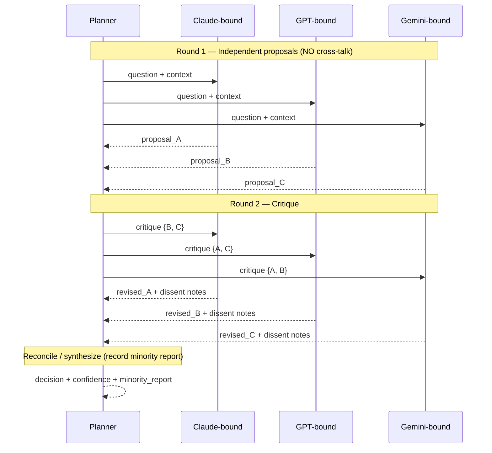

# Council Skill — Cross-Model Deliberation

Formalizes the intuition that asking several models the same hard question — and having them
argue — tends to produce a stronger answer than any one alone. Used selectively by the planner
when a decision is high-uncertainty, high-stakes, or contested by sub-agents.

## When to use (and when NOT to)

✅ Use when:
- The decision is **high-stakes** (will gate a T3/T4 action) and the planner is uncertain.
- Two sub-agents have returned **contradictory** results on overlapping work.
- The task is **ambiguous** and the planner cannot pick between several reasonable decompositions.
- A research condition is **C5** (HITL + Council enabled).

❌ Do **not** use when:
- The decision is routine and a single capable model handles it (Council multiplies cost).
- The task is **strictly sequential** with no real branching choice (debate adds latency, not value).
- You are tempted to use it as a confidence-boosting ritual on every step — that is the failure
  mode the literature warns about (see [`conclave-spec.md` §10](../../conclave-spec.md)).

The planner's invocation policy:
[`planner-agent/planner-runner/references/dispatch-protocol.md`](../../planner-agent/planner-runner/references/dispatch-protocol.md).

## Protocol



### Step-by-step

#### 1. Independent first pass (anti-anchoring)

Send the question + context to every model **in parallel**, with no visibility into the others'
answers. This is non-negotiable. The most common debate failure mode is anchoring on whoever
answered first.

Each model returns a `proposal`:

```json
{
  "modelBinding": "claude-opus-4.7",
  "answer": "...",
  "rationale": "...",
  "confidence": 0.62,
  "assumptions": ["..."],
  "risks": ["..."]
}
```

#### 2. Structured critique round

Show each model the other proposals (de-identified — strip model names so critique is on
content, not on prestige) and ask:

> "Here are N independent proposals to the same question. For each, identify (a) one thing it
> gets right, (b) the strongest objection, and (c) what evidence would change your mind. Then
> revise your own answer if appropriate."

Each model returns `{revisedAnswer, critiques[], changedMind: boolean, residualDissent}`.

#### 3. Synthesis (with mandatory minority report)

The planner produces:

```json
{
  "decision": "...",
  "majorityRationale": "...",
  "confidence": 0.0,
  "convergence": "unanimous" | "majority" | "split" | "no-consensus",
  "minorityReport": {
    "summary": "what the dissenting view was, kept verbatim where possible",
    "raisedBy": ["gpt-5"],
    "strongestPoint": "..."
  },
  "rounds": 2,
  "tokensSpent": { "input": 0, "output": 0, "thinking": 0 }
}
```

**The minority report is mandatory whenever convergence is not unanimous.** Discarding it is
the exact harm the literature flags ("majority pressure can suppress a correct minority" —
[`conclave-spec.md` §10](../../conclave-spec.md)).

#### 4. Confidence-gated escalation

| `confidence` | `convergence` | Action |
|---|---|---|
| ≥ 0.85 | unanimous or strong majority | Planner adopts the decision; logs and proceeds. |
| 0.6 – 0.85 | majority | Planner adopts but flags the minority report; if the next action is T3/T4 it goes through the gate as usual. |
| < 0.6 | any | **Escalate to the principal.** Do not auto-proceed. Council confidence below this threshold means the models themselves do not know. |
| any | `no-consensus` after `maxRounds` | Escalate. Do not have the planner "tie-break" — that just makes the planner's model the deciding vote and defeats the diversity. |

## Anti-conformity safeguards (summary)

1. **Independent first pass.** No cross-talk in round 1.
2. **De-identified critique.** Strip model names in round 2.
3. **Minority report is preserved**, not summarized away.
4. **Confidence-gated escalation.** Low confidence → human, not majority vote.
5. **Selective invocation.** Council is invoked only on flagged decision classes, never on routine steps.
6. **Diversity-first model selection.** Prefer 3 models from different families over 3 instances
   of the same model. (Same-family instances often agree by default, eliminating the point of debate.)

## Provenance

Council deliberations emit:

- `council_convened` (with the question + participating model bindings)
- `council_proposal` × N
- `council_critique` × N
- `council_synthesis` (with confidence, convergence, minority report)

Every event references the same `threadId` so the deliberation is reconstructable from the
log alone. See [`shared/provenance/SKILL.md`](../provenance/SKILL.md).

## Cost accounting

Council multiplies tokens by roughly *N × rounds*. The planner must respect the run's
`tokenBudget` if set, and may down-scope (fewer models, fewer rounds) or skip Council if the
budget would be exceeded. Log this as a `council_skipped` reason for the research harness.
